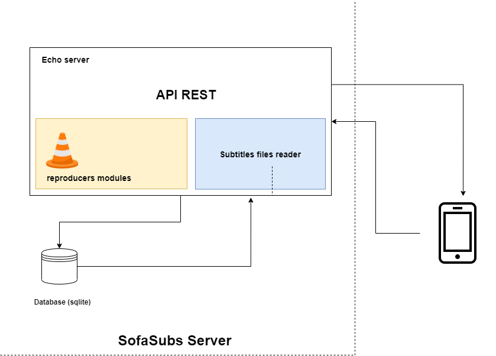

# SofaSubs Server

SofaSubs Server is a web server written in go, uses [echo framework](https://echo.labstack.com/) and give a api to use in different applications.

# What is SofaSubs ?

SofaSubs is a product to learn languages only using two things a sofa and subtitles (really you need more things like a tv ...).

It is intended for those who watch tv show or movies in vose, but don't have a total command of the language.

If you are watching the tv show on the computer you can always pause and look for the translation, but if you are sitting on the couch this becomes more complicated.

This is where it comes in SofaSubs, through a mobile application you can pause the series and see the translation of the subtitle in your language, and saving it (to review it in the future).

# Contribution Guidelines

Please read the [contribution guidelines](https://github.com/SofaSubs/server/blob/main/CONTRIBUTING.md)